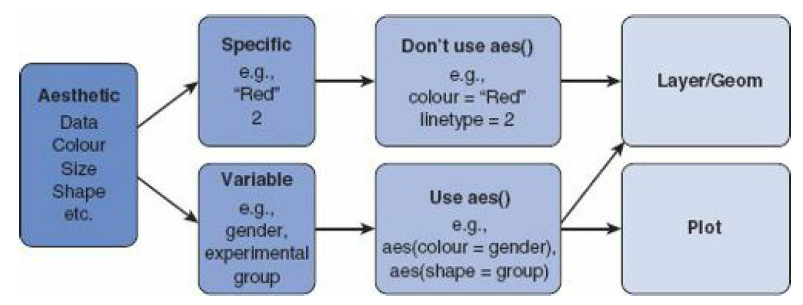
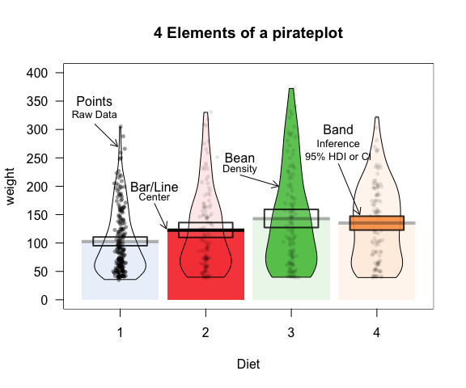

```{r setup_output, include=FALSE}
library(knitr)
hook_output_def = knitr::knit_hooks$get('output')
knitr::knit_hooks$set(output = function(x, options) {
  if (!is.null(options$vspaceout)) {
    end <- paste0("\\vspace{", options$vspaceout, "}")
    stringr::str_c(hook_output_def(x, options), end)
  } else {
    hook_output_def(x, options)
  }
})

hook_source_def = knitr::knit_hooks$get('source')
knitr::knit_hooks$set(source = function(x, options) {
  if (!is.null(options$vspaceecho)) {
    begin <- paste0("\\vspace{", options$vspaceecho, "}")
    stringr::str_c(begin, hook_source_def(x, options))
  } else {
    hook_source_def(x, options)
  }
})
```

```{r, include = FALSE}
# install.packages("tidyverse", dep = TRUE)
# install.packages("ggedit", dep = TRUE)
# install.packages("reshape2", dep = TRUE)
# install.packages("coefplot", dep = TRUE)
# install.packages("cowplot", dep = TRUE)
```

```{r global_options, include=FALSE}
knitr::opts_chunk$set(fig.pos = 'H', fig.align = "center")
knitr::opts_chunk$set(vspaceout='2em')
knitr::opts_chunk$set(vspaceecho='1em')
```

# Grundlagen und Begriffe

``ggplot2`` baut Grafiken grundsätzlich aus verschiedenen Ebenen ("Layers") auf. Ein Layer kann grundsätzlich jedes grafische Element, wie das Koordinatensystem, Balken, Punkte, Linien usw. sein. Dies bietet den Vorteil, das jedes Element einzeln angesprochen und auch modifiziert werden kann.

Ausführliche Erläuterungen zu ``ggplot2`` finden sich in Kapitel 4 von Field et al. (2012) sowie in Wickham, H. (2016): ggplot2: Elegant Graphics for Data Analysis. New York: Springer. 

Laden wir zunächst das ``tidyverse`` Paket:

```{r, eval = FALSE, echo = TRUE}
library(tidyverse)
```

```{r, include = FALSE}
library(tidyverse)
```

``ggplot2`` ist ein Teil des Pakets ``tidyverse``. Wir müssen es also nicht einzeln laden.

Die Darstellung wird etwas publikationsfreundlicher, wenn wir zusätzlich das Paket ``cowplot`` laden:

```{r, eval = FALSE, echo = TRUE}
install.packages("cowplot", dep = TRUE)
library(cowplot)
```

```{r, include = FALSE}
library(cowplot)
```


\newpage
## Grundstruktur

Eine Grafik hat in ``ggplot2`` drei Kernkomponenten:

1. **Daten**
2. Ein Set von s.g. **aesthetic mappings**, also eine Verknüpfung von Daten und visuellen Eigenschaften
3. Mindestens ein **Layer**, der beschreibt, wie die einzelnen Beobachtungen dargestellt werden sollen.

Im Folgenden können wir das an einem Beispiel betrachten. Wir nutzen dafür den Datensatz ``mpg``, ein Beispieldatensatz von ``ggplot2``, der Daten zum Benzinverbrauch verschiedener Autos zur Verfügung stellt und automatisch mit ``tidyverse`` geladen wird:

```{r fig.width=5, fig.height=3.5}
ggplot(mpg, 
       aes(y = hwy, x = displ)) +
    geom_point()
```

1. Daten: Der Datensatz (``mpg``) wird unmittelbar nach dem Grundbefehl ``ggplot`` angegeben.
2. Aesthetic mapping (``aes()``): Benzinverbrauch auf die y-Achse (``y = hwy``) und Hubraum auf die x-Achse (``x = displ``) gemappt.
3. Layer: Punkte (``geom_point``) nach einem ``+`` an den Grundbefehl angefügt.


## Geoms

Die grundlegende Form einer Grafik wird durch ein *Geom* definiert. Im oberen Beispiel haben wir mit ``geom_point()`` einen Scatterplot definiert. Es gibt aber noch viele weitere Geoms. Die gebräuchlichsten sind:

- ``geom_bar()``: Balkendiagramm
- ``geom_point()``: Scatterplot
- ``geom_line()``: Verknüpfung von Datenpunkten mit einer Geraden.
- ``geom_smooth()``: "Smoother" (z. B. eine Regressionsgerade)
- ``geom_histogram()``: Histogram
- ``geom_boxplot()``: Boxplot
- ``geom_text()``: Text (i.d.R. zusätzlich zu einem anderen Geom. Zum Beispiel Beschriftungen von Datenpunkten)
- ``geom_density()``: Density plot (wie zum Beispiel eine Kerndichtefunktion in einem Histogramm)
- ``geom_errorbar()``: Fehlerbalken (z. B. Konfidenzintervalle)
- ``geom_hline()`` und ``geom_vline()``: Nutzerdefinierte horizontale oder vertikale Linie

## Aesthetics

Aesthetics steuern das Erscheinungsbild von Elementen innerhalb eines Geoms. Dies kann in zwei Formen geschehen. Entweder für die gesamte Grafik, dann wird das Aesthetics in der ersten Zeile innerhalb von ``ggplot()`` angegeben, oder für ein einzelnes Geom, dann wird es innerhalb von ``geom_XXX()`` angegeben. 

Für die verschiedenen Geoms müssen immer einer oder mehrere Aesthetics zwangsweise angegeben werden. Dies ist jeweils die Angabe, welche Daten wie dargestellt werden sollen (z. B. x-Koordinate und y-Koordinate). Dazu stehen weitere Einstellungen wie Farbe, Größe oder Symbol zur Verfügung. Field et al. (2012) geben in Kapitel 4.3.2 einen Überblick über erforderliche und optionale Aesthetics für die wichtigsten Geoms.

### Spezifische und variable Aesthetics

Aesthetics unterscheiden sich darin, ob sie auf einen festen Wert definiert werden oder als Funktion einer Variable. Ein fester Wert, ist zum Beispiel die Farbe rot (``color = "red"``). Ein variabler Wert wäre die Farbe in Abhängigkeit des Geschlechts (``color = gender``).

Je nach dem, ob ein Aesthetic spezifisch oder variabel ist, unterscheidet sich der Befehlsaufbau. Spezifische Aesthetics werden ohne ``aes()`` verwendet (z. B. ``color = "red"``). Variable Aesthetics erfordern hingegen die Verwendung von ``aes()`` (z. B. ``aes(color = gender)``). Eine gute Übersicht hierzu liefern Field et al. (2012):




# Scatterplot

Beginnen wir unseren kurzen Überblick über die wichtigsten Grafiken mit dem Scatterplot. Nutzen wir hierfür die Exam Anxiety Daten, die wir bereits kennen:

```{r, error = FALSE, warning = FALSE, fig.width=6, fig.height=4.5}
exam <- read_csv("data/exam_anxiety.csv")

```

\newpage
```{r, error = FALSE, warning = FALSE, fig.width=5, fig.height=3.5}
scatter <- ggplot(exam, aes(x = anxiety, y = exam)) +
  geom_point()
scatter
```


Mit dem Layer ``labs`` können wir die Beschriftung der Achsen sowie den Titel ändern.

```{r, error = FALSE, warning = FALSE, fig.width=5, fig.height=3.5}
scatter <- ggplot(exam, aes(x = anxiety, y = exam)) +
  geom_point() + 
  labs(x = "Exam Anxiety", 
       y = "Exam Performance",
       title = "Zusammenhang von Prüfungsleistung und Prüfungsangst")
scatter
```

\newpage
Zu einem Zusammenhang möchten wir natürlich auch noch eine Regressionsgerade hinzufügen. Mit ``geom_smooth`` ist dies kein Problem (\verb!geom_smooth(method = "lm", color = "red")!:

```{r, error = FALSE, warning = FALSE, fig.width=5, fig.height=3}
scatter <- ggplot(exam, aes(x = anxiety, y = exam)) +
  geom_point() + 
  geom_smooth(method = "lm", color = "red") + 
  labs(x = "Exam Anxiety", y = "Exam Performance",
       title = "Zusammenhang von Prüfungsleistung\n und Prüfungsangst")
scatter
```


Zusätzlich wäre möglicherweise der Unterschied zwischen Männern und Frauen interessant. Hierfür könnten wir die einzelnen Punkte nach Geschlecht einfärben (``geom_point(aes(color = gender))``):

```{r, error = FALSE, warning = FALSE, fig.width=5, fig.height=3}
scatter <- ggplot(exam, aes(x = anxiety, y = exam)) +
  geom_point(aes(color = gender)) + 
  labs(x = "Exam Anxiety", y = "Exam Performance",
       title = "Zusammenhang von Prüfungsleistung\n und Prüfungsangst")
scatter
```

\newpage
Bringen wir nun noch Regressionsgerade und Geschlechterunterschiede zusammen und fügen zwei Regressionsgeraden für die Geschlechter hinzu. Hierfür fügen wir zu ``geom_smooth`` einen Aesthetic hinzu (``geom_smooth(method = "lm", aes(fill = gender))``).

```{r, error = FALSE, warning = FALSE, fig.width=5, fig.height=3.5}
scatter <- ggplot(exam, aes(x = anxiety, y = exam)) +
  geom_point(aes(color = gender)) + 
  geom_smooth(method = "lm", aes(color = gender)) +
  labs(x = "Exam Anxiety", 
       y = "Exam Performance in %",
       title = "Zusammenhang von Prüfungsleistung\n und Prüfungsangst")
scatter
```

\newpage
# Histogramm

Zur Erstellung eines Histogramms steht das Geom ``geom_histogram()`` zur Verfügung:

```{r, fig.width=5, fig.height=3, warning=FALSE, message=FALSE}
hist <- ggplot(mpg, aes(x = displ)) + 
  geom_histogram()
hist
```


Zu diesem Histogramm können wir auch eine Kerndichtefunktion hinzufügen. Dazu geben wir für das Aesthetic an, dass die Werte als Dichtefunktion dargestellt werden sollen: ``aes(x = displ, stat(density))``. Zusätzlich fügen wir ein neues Geom ``geom_density()`` hinzu.

```{r, fig.width=5, fig.height=3, warning=FALSE, message=FALSE}
hist <- ggplot(mpg, aes(x = displ, stat(density))) + 
  geom_histogram() +
  geom_density(color = "red")
hist
```

\newpage
# Boxplot

Für Boxplots ist das Geom ``geom_boxplot()`` zuständig.

```{r fig.width=5, fig.height=3}
boxplot <- ggplot(mpg, aes(y = hwy)) + 
  geom_boxplot()
boxplot
```


Gruppenunterschiede können ebenfalls sehr einfach dargestellt werden:

```{r fig.width=6, fig.height=3}
boxplot <- ggplot(mpg, aes(y = hwy, x = class)) + 
  geom_boxplot()
boxplot
```


Um dem/der Betrachter*in einen umfassenden Eindruck von der Verteilung der Daten zu geben, empfiehlt es sich, nicht nur die Ausreißer, sondern alle Datenpunkte einzublenden. Hierfür können wir das Geom ``geom_jitter`` verwenden. Um die Ausreißer nicht doppelt zu plotten, fügen wir bei ``geom_boxplot`` die Option ``outlier.shape = NA`` hinzu.

```{r fig.width=6, fig.height=3}
boxplot <- ggplot(mpg, aes(y = hwy, x = class)) + 
  geom_boxplot(outlier.shape = NA) + 
  geom_jitter(width = 0.05, color = "gray") 
boxplot
```

\newpage
# Pirateplot

Der "Pirateplot" aus dem Paket ``yarrr`` ist eine Visualisierung, die umfassende Informationen über die Daten bereitstellt. Nathaniel Phillips, der Entwickler des Pirateplots beschreibt ihn wie folgt (https://cran.r-project.org/web/packages/yarrr/vignettes/pirateplot.html):

> A pirateplot, is the RDI (Raw data, Descriptive statistics, and Inferential statistics) plotting choice of R pirates who are displaying the relationship between 1 to 3 categorical independent variables, and one continuous dependent variable.
>
> A pirateplot has 4 main elements
>
> 1. points, symbols representing the raw data (jittered horizontally) 
> 2. bar, a vertical bar showing central tendencies
> 3. bean, a smoothed density (inspired by Kampstra and others (2008)) representing a smoothed density
> 4. inf, a rectangle representing an inference interval (e.g.; Bayesian Highest Density Interval or frequentist confidence interval)



\newpage
Ein Pirateplot ist schnell erstellt:

```{r, eval = FALSE, echo = TRUE}
library(yarrr)
```

```{r, include = FALSE}
library(yarrr)
```


```{r}
pirateplot(hwy ~ class,
           data = mpg,
           inf.method = "ci", # Konfidenzintervalle statt HDI
           theme = 3) 
```


# Balkendiagramm

Ein kleiner Hinweis vorweg: Balkendiagramme sind keine ideale Visualisierung von Daten, da sehr unterschiedliche Daten dieselben Balkendiagramme produzieren können. Es gibt daher inzwischen viele Experten, die fordern, keine Balkendiagramme in wissenschaftlichen Publikationen zu nutzen (https://simplystatistics.org/2019/02/21/dynamite-plots-must-die/). Als Alternativen bieten sich Boxplots oder auch der Pirateplot (s.o.) an. Bei relativ wenigen Beobachtungen, wie wir sie bei Experimenten häufig haben, bietet es sich auch an, zusätzlich die Daten zu plotten.

Für ein Balkendiagramm, nutzen wir das Geom ``geom_bar``. Dieses erwartet allerdings bereits aufbereitete Daten, die in einer Variable verschiedenen Gruppen und in der anderen die dazugehörigen Werte speichert. Wenn man, wie im folgenden Beispiel, den Mittelwert verschiedener Variablen in ``Lecturer_Data`` darstellen möchte, benötigt man also aufbereitete Daten. Um dies nicht händisch erledigen zu müssen, verwenden wir die Funktion ``stat_summary()``. Diese Funktion ist folgendermaßen aufgebaut: 

``stat_summary(function = x, geom = y)``

Wobei für ``function`` verschiedene Funktionen zur Verfügung stehen. Wir wählen hier ``y.fun = mean`` um den Mittelwert der y-Variable zu bekommen. Für ``geom`` können alle Geoms von ``ggplot2`` verwendet werden. Wir wählen hier ``"bar"``. 

Leider erwartet ``geom_bar`` sowohl eine abhängige Variable als auch eine Gruppierungsvariable. Wir wenden daher einen kleinen Trick an und definieren einen festen Wert als Gruppierungsvariable: ``x = factor(1)``.


```{r fig.width=5, fig.height=3.5}
lecturer <- read_csv("data/Lecturer_Data.csv") # Lecturer Datensatz importieren
bar <- ggplot(lecturer, aes(y = alcohol, x = factor(1))) +
  stat_summary(fun.y = "mean", geom = "bar") 
bar
```


Um die Grafik etwas aussagekräftiger zu gestalten, definieren wir noch die Spannweite von 0 bis zum Maximum der Variable *alcohol.* Hierfür verwenden wir den Layer ``scale_y_continuous()``: ``scale_y_continuous(limits = c(0, max(lecturer$alcohol)))``. Außerdem ersetzen wir noch die Beschriftung der Achsen und fügen einen Titel hinzu: \verb!labs(x = "", y = "Alkoholkonsum in Liter pro Jahr",! \newline
\verb!title = "Bedenklicher Alkoholkonsum an Uni Hamburg")!

```{r fig.width=5, fig.height=3.5}
bar <- ggplot(lecturer, aes(y = alcohol, x = factor(1))) +
  stat_summary(fun.y = "mean", geom = "bar") + 
  scale_y_continuous(limits = c(0, max(lecturer$alcohol))) + 
  labs(x = "", 
       y = "Alkoholkonsum in Liter pro Jahr", 
       title = "Bedenklicher Alkoholkonsum an Uni Hamburg")
bar
```


Zusätzlich wäre nun noch ein Fehlerbalken interessant, der den 95 %-Konfidenzintervall des Mittelwertes anzeigt. Dazu verwenden wir ebenfalls einen ``stat_summary`` Layer: ``stat_summary(fun.data = mean_cl_normal, geom = "pointrange")``


```{r fig.width=5, fig.height=3.5}
bar <- ggplot(lecturer, aes(y = alcohol, x = factor(1))) +
  stat_summary(fun.y = "mean", geom = "bar") + 
  stat_summary(fun.data = mean_cl_normal, geom = "pointrange") + 
  scale_y_continuous(limits = c(0, max(lecturer$alcohol))) + 
  labs(x = "", y = "Alkoholkonsum in Liter pro Jahr", 
       title = "Bedenklicher Alkoholkonsum an Uni Hamburg")
bar
```

\newpage
Da wir ja bereits einen festen Wert für die Gruppierungsvariable festgelegt haben, ist es kein großer Schritt, unterschiedliche Gruppen darzustellen. Wenn wir beispielsweise den Alkoholkonsum von Dozenten und Studierenden unterscheiden wollen, definieren wir die Variable *job* als Gruppierungsvariable. Vorher definieren wir die Gruppierungsvariable allerdings noch als Faktor, damit wir schöne Beschriftungen für die einzelnen Balken bekommen: \verb!lecturer$job <- factor(lecturer$job, labels = c("Dozenten", "Studierende"))!

```{r fig.width=5, fig.height=3.5}
lecturer$job <- factor(lecturer$job, labels = c("Dozenten", "Studierende"))

bar <- ggplot(lecturer, aes(y = alcohol, x = job)) +
  stat_summary(fun.y = "mean", geom = "bar") + 
  stat_summary(fun.data = mean_cl_normal, geom = "pointrange") + 
  scale_y_continuous(limits = c(0, max(lecturer$alcohol))) + 
  labs(x = "Job", y = "Alkoholkonsum in Liter pro Jahr", 
       title = "Studierende trinken mehr als Dozenten?")
bar
```


# Balkendiagramme für mehrere Variablen

Etwas komplizierter wird es, wenn wir mehrere Variablen in einer Grafik darstellen wollen, da wir hierfür die Daten aufbereiten müssen. Gehen wir davon aus, dass wir ``alcohol`` und ``neurotic`` gemeinsam darstellen wollen (was natürlich nur Sinn ergibt, wenn diese identisch skaliert sind). Hierfür müssen wir ein neues Objekt generieren, dass in einer Spalte den Variablennamen und in einer anderen Spalte den jeweiligen Wert eines Probanden enthält. Hierfür verwenden wir die Funktion ``melt`` aus dem Paket ``reshape2``. Zusätzlich benötigen wir wieder eine Gruppierungsvariable. 

```{r, eval = FALSE, echo = TRUE}
install.packages("reshape2", dep = TRUE)
library(reshape2)
```

```{r, include = FALSE}
library(reshape2)
```

```{r}
# Variablen auswählen
lecturer3 <- select(lecturer, alcohol, neurotic)

# Gruppierungsvariable erstellen
lecturer3$group = factor(1)

# Datensatz transformieren
lecturer3_melt <- melt(lecturer3 ,id = "group")   

lecturer3_melt
```


Anschließend können wir die Grafik bauen:

```{r fig.width=5, fig.height=3.5}
bar <- ggplot(lecturer3_melt, aes(x = variable, y = value)) + 
  stat_summary(fun.y=mean, geom = "bar") + 
  stat_summary(fun.data = mean_cl_normal, geom = "pointrange") +
  scale_y_continuous(limits = c(0, max(lecturer$alcohol))) + 
  labs(x = "", y = "Messwert", 
       title = "Alkoholkonsum und Neurotizismus an der UHH")
bar
```


Um auch in dieser Grafik zwischen Dozenten und Studierenden unterscheiden zu können müssen wir dies zunächst bei ``melt()`` berücksichtigen (``id = "job"``):

```{r}
# Variablen auswählen
lecturer4 <- select(lecturer, alcohol, neurotic, job)

# Datensatz transformieren
lecturer4_melt <- melt(lecturer4 ,id = "job")   
head(lecturer4_melt)
```


In der Grafik sind nun einige Änderungen notwendig. Zunächst einmal fügen wir zu ``ggplot()`` ein weiteres Aesthetic hinzu: ``fill = job``. Dieses gibt an, dass die Balken entsprechend der Variable "job" eingefärbt werden. Zusätzlich benötigen wir noch bei den beiden ``stat_summary`` Layers die Option ``position = position_dodge(1)``. Diese sorgt dafür, dass die Balken nicht übereinander, sondern nebeneinander dargestellt werden.

```{r fig.width=6, fig.height=3.5}
bar <- ggplot(lecturer4_melt, 
              aes(x = variable, y = value, fill = job)) + 
  stat_summary(fun.y = mean, geom = "bar", 
               position = position_dodge(1)) + 
  stat_summary(fun.data = mean_cl_normal,  geom = "pointrange", 
               position = position_dodge(1)) +
  scale_y_continuous(limits = c(0, max(lecturer$alcohol))) + 
  labs(x = "",  y = "Messwert", 
       title = "Alkoholkonsum und Neurotizismus an der UHH") 
bar
```


# Regressionsergebnisse grafisch darstellen

Regressionsergebnisse müssen nicht immer in einer Tabelle dargestellt werden. Intuitiver ist die Darstellung in einem so genannten Coefficient Plot oder kurz Coefplot. Um nicht händisch die Werte aus dem Regressionsergebnis exportieren und dann plotten zu müssen, nutzen wir das Paket ``coefplot``.

```{r, eval = FALSE, echo = TRUE}
install.packages("coefplot", dep = TRUE)
library(coefplot)
```

```{r, include = FALSE}
library(coefplot)
```

Versuchen wir also das Regressionsergebnis unserer multiplen Regression aus Teil 2 grafisch darzustellen. Hierzu importieren wir zunächst die Daten und schätzen dann die Regression. 

```{r}
albums <- read_csv("data/album_sales.csv")
model_albums2 <- lm(sales ~ adverts + airplay + attract, data = albums)
summary(model_albums2)
```

\newpage
Mit ``coefplot`` können wir dieses Ergebnis nun grafisch darstellen:

```{r fig.width=5, fig.height=3.5}
coefplot(model_albums2)
```

Um das ganze noch etwas aufzuhübschen, blenden wir die Konstante aus (``intercept = FALSE``) und stellen die Farbe auf schwarz um (``color = "black"``):

```{r fig.width=5, fig.height=3.5}
coefplot(model_albums2, 
         intercept = FALSE, 
         color = "black")
```


\newpage
# Grafiken mit der Maus bearbeiten: ``ggedit``

In ``RStudio`` kann man mit dem Paket ``ggedit`` auch mit der Maus Hand an eine Grafik legen. 

```{r, eval = FALSE, echo = TRUE}
install.packages("ggedit", dep = TRUE)
library(ggedit)
```

```{r, include = FALSE}
library(ggedit)
```

Hierfür übergibt man eine grafisches Objekt, wie das ``scatter`` Objekt, dass wir generiert haben, an die Funktion ``ggedit()``.

```{r, eval = FALSE, echo = TRUE}
scatter <- ggplot(exam, aes(x = anxiety, y = exam)) +
  geom_point()
ggedit(scatter)
```

Eine ausführliche Anleitung zu ``ggedit`` gibt es im "ggedit gitbook": https://metrumresearchgroup.github.io/ggedit/.

